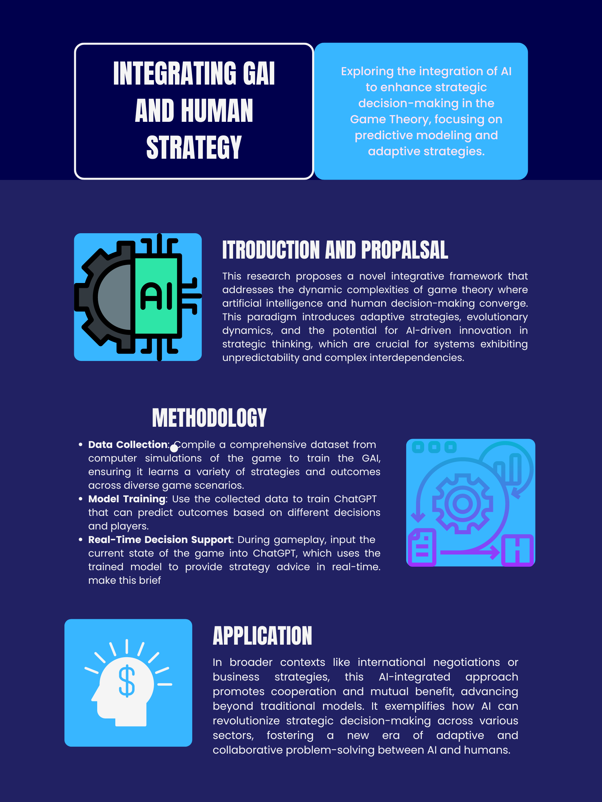

# Integrating GAI and Human strategy: A New Paradigm in Game Theory

[Overleaf URL](https://www.overleaf.com/project/6627c756d61b7264393044c1)

## Background/Motivation
The digital economy and complex systems involving both human and AI agents reveal substantial gaps in traditional game theory. Traditional models do not dynamically represent real-time strategic interactions adequately. This project aims to develop a more robust theoretical model that incorporates unpredictable interactions between AI and humans, particularly useful in sectors like cybersecurity and automated trading systems.

## Research Questions
- How can game theory be adapted to better integrate the capabilities of General Artificial Intelligence (GAI) within systems involving human agents?
  - Game theory can be adapted to integrate GAI by enhancing the model frameworks to accommodate the advanced cognitive capabilities of GAI. This includes evolving the traditional game rules and outcomes based on the learning inputs from both human and GAI agents. The integration involves creating dynamic game environments that allow for continuous learning and adaptation, reflecting both AI's predictive capabilities and human intuition and ethics. This approach could lead to more comprehensive and adaptive strategic frameworks that can dynamically adjust to the changing preferences and strategies of human and AI agents.
- What strategies can enable effective cooperation between AI and human agents in complex decision-making environments?
  - Strategies to enable effective cooperation between AI and human agents include designing AI systems that are transparent in their decision-making processes, promoting trust and understanding. Incorporating mechanisms for mutual feedback where both AI and humans can adjust their strategies based on ongoing outcomes can also foster cooperation. Implementing AI systems that not only optimize for winning strategies but also for cooperative and ethically aligned outcomes can further enhance this cooperation, ensuring decisions are beneficial on an individual and collective basis. 
- Why are these questions critical for advancing our understanding of strategic AI integration into societal frameworks?
  - These questions are critical because they address the fundamental challenges and opportunities in the era of AI integration into society. Understanding how to adapt game theory for AI and human collaboration is essential for designing systems that are just, equitable, and capable of handling complex societal issues. It ensures that AI contributes positively to strategic decision-making in fields like economics, politics, and public policy, aligning AI capabilities with human welfare and ethical standards. 
- What limitations in existing game theory models prevent them from addressing these dynamic interactions?
  - Current game theory models often assume static rules and rational behavior, which do not adequately capture the unpredictable and adaptive nature of human and AI interactions. Many models fail to account for the learning abilities of AI systems and the irrationalities of human decision-making. The lack of integration of behavioral economics and adaptive algorithms limits the applicability of traditional game theory in scenarios where AI and humans interact dynamically. Moreover, existing models rarely address the ethical implications and potential biases inherent in AI systems, which are crucial for societal applications.
## Application Scenario
1. **In which real-world situation does your newly proposed game and/or solution concept or mechanism apply?**
  - The integration of General Artificial Intelligence (GAI) into strategic frameworks can significantly enhance decision-making processes in international climate negotiations. By utilizing AI's ability to process vast amounts of data and generate predictive insights, human negotiators can make more informed decisions that balance national interests with global sustainability goals.
2. **What is the literature in other disciplines such as psychology that could provide a behavioral foundation for your newly proposed game and/or solution concept, or mechanism?**
  - Insights from behavioral economics and psychology, particularly theories related to cooperation, trust, and decision-making under uncertainty, offer a foundational understanding of how human and AI agents might interact. This literature explores how human biases and heuristic-driven decisions can be complemented by AI's rational and data-driven processes to foster cooperative strategies in complex negotiation scenarios.

## Methodology
1. **What is the key game theoretical or mechanism design framework that you build upon?**
     - The research builds upon advanced game theory models, particularly those incorporating General Artificial Intelligence (GAI) within human-agent systems. This involves using game theory to analyze strategic interactions that are dynamic and adaptive, enhancing traditional models with the capability to evolve as interactions unfold.
3. **What are the key computational or analytical tools that you apply to answer your research question?**
     -  The project employs a combination of AI-driven simulation tools and evolutionary algorithms that allow for the modeling of complex, adaptive systems where strategies and decisions evolve over time. These tools are crucial for analyzing how changes in strategy affect overall system dynamics and outcomes.
5. **What is the advanced technology or interdisciplinary insights that you integrate into the existing methods that smartly solve your research question?**
     - The research integrates insights from behavioral economics and cognitive psychology into the game theory framework. By understanding how humans make decisions under uncertainty and incorporating these behavioral models into AI algorithms, the project smartly addresses complex decision-making environments, enhancing predictive accuracy and strategic adaptability.

## Preliminary Results
1. **Can you provide a concrete illustration example of game theory or mechanism design that your approach significantly improves at least one objective of human welfare compared to existing research without your approach?**
   - The adaptation of the Centipede Game with AI-driven strategies showcases substantial improvements in strategic decision-making. This AI-enhanced approach leads to more informed decisions, potentially increasing financial gains and promoting cooperative behavior among players. The AI model analyzes historical gameplay to offer real-time strategic advice, significantly improving outcomes over traditional methods by fostering a deeper understanding of mutual benefits and trust, key aspects of human welfare in economic and social contexts.

## Intellectual Merits and Practical Impacts
1. **Can you demonstrate the limitation of your current research that would inspire future research?**
   - The current research effectively integrates AI with traditional game theory in a controlled setting. However, it primarily addresses scenarios with well-defined parameters and predictable interactions, which may not fully represent the complexity and unpredictability of real-world situations. Future research could extend this approach to more complex and dynamic environments where variables are constantly changing and less predictable. This expansion could explore how scalable and adaptable the AI integration is across a broader range of game theory applications and more diverse strategic contexts, such as those involving multiple stakeholders with competing interests or in environments with incomplete information. Additionally, studying the impact of different types of AI algorithms on the outcomes of these game theoretic models could provide deeper insights into optimizing interactions in varied real-world scenarios.
2. **Can you elaborate on how your research can be applied to improve individual, company, and government decisions in strategic scenarios or social choice issues?**
    - This research has practical applications across various strategic decision-making scenarios. For individuals, it offers enhanced decision-support tools that can lead to better financial and personal outcomes by understanding and predicting the behavior of others in competitive or cooperative settings. For companies, the integration of strategic AI can optimize negotiation tactics, supply chain decisions, and competitive strategies in the marketplace. Governments can use these insights to craft better policies that consider the strategic interactions between different societal groups, leading to more effective governance and social welfare optimizations. The adaptability of this AI-driven game theory approach enables tailored solutions that align closely with the specific strategic needs and social choices of each sector.

